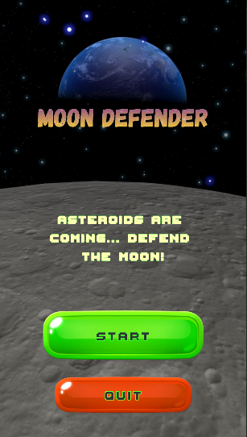
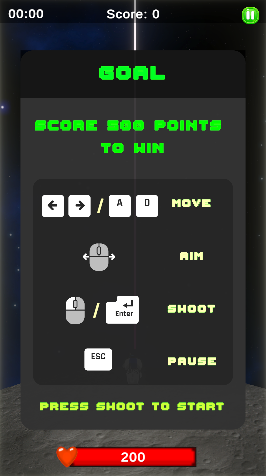
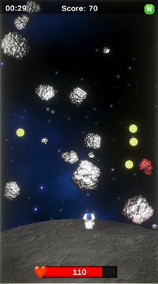
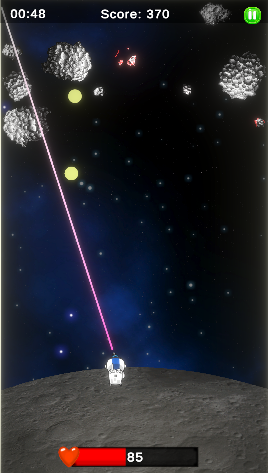
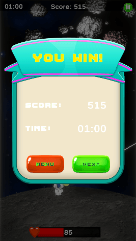

# 🚀 Moon Defender
Here is my first simple 2D mobile style game!

You can play it [**HERE!**](https://manuelcol89.github.io/Moon-Defender-Unity/)

## 🖋️ Description
In this game you have to save the moon from an asteroid swarm... if you are able to.

You have only 8 bullets per time, use them carefully!

## 📸 Screenshots
<p align="center">
  &nbsp;
  &nbsp;<br>
  &nbsp;
  &nbsp;<br>
  
</p>

## 🕹️ How to play
*   **Move player:** Left and right arrows / A D
*   **Aim:** Mouse pointer
*   **Shoot:** Left click / Enter
*   **Pause:** Esc
*   **Goal:** Reach 500 points!

## 📝 Roadmap / TODO
- [ ] Set more levels
- [ ] Add different weapons and characters
- [ ] Add awards

## 💻 Development
This game is hosted in the `gh-pages` branch of this repo and is created in C# for Unity.

To clone this project locally, run the following command in your terminal:

```bash

git clone https://github.com/Manuelcol89/Moon-Defender-Unity.git

```


Enjoy! 😊
